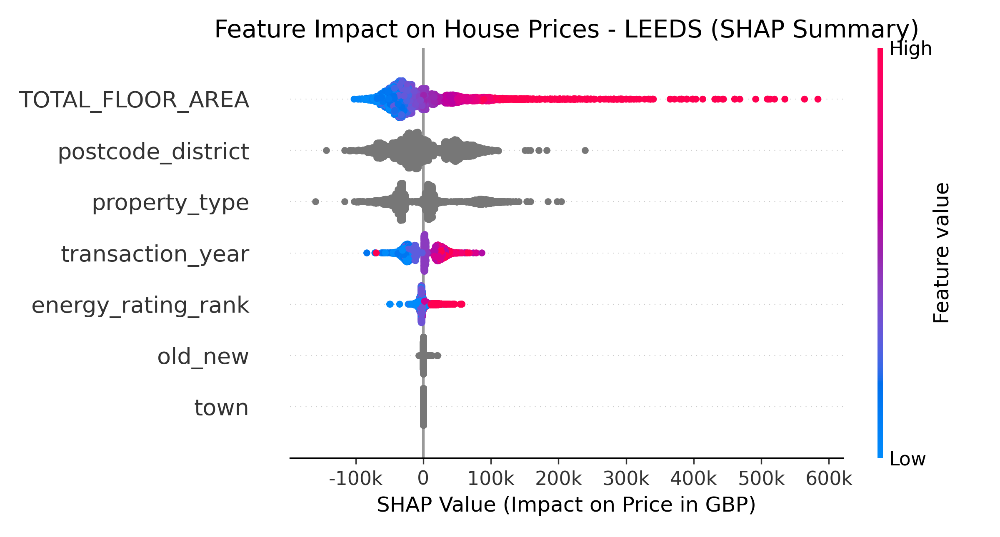
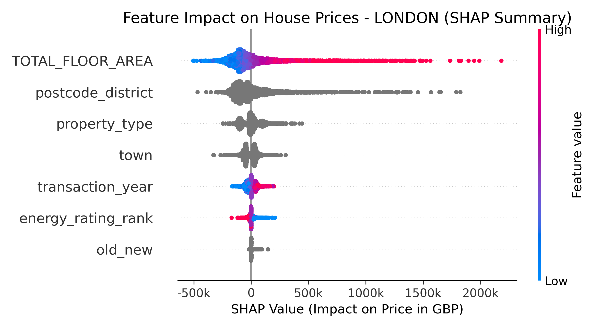
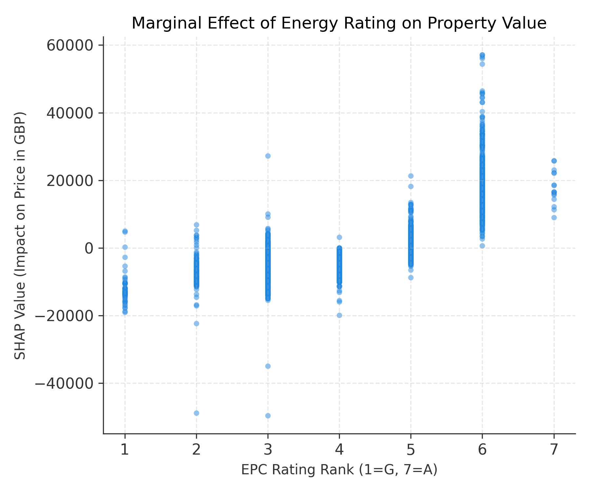

# The Heritage Paradox: Decoupling Energy Efficiency from Property Value in the UK Housing Market

## Abstract
This project investigates the relationship between Energy Performance Certificates (EPC) and residential property prices in the United Kingdom. While the "Green Premium" hypothesis suggests that energy-efficient homes command higher market values, my analysis reveals a significant divergence in the London market. We term this phenomenon **"The Heritage Paradox"**: in London, location and historical character (often associated with lower energy efficiency) outweigh the financial benefits of modern energy standards.

To validate this hypothesis, I employed a comparative analysis using **Leeds** as a control group, demonstrating that standard market behaviors regarding energy efficiency remain intact outside the capital.

---

## Methodology & Data Pipeline

### 1. Data Sources & Ingestion
The analysis integrates two primary datasets:
- **HM Land Registry Price Paid Data:** Transaction records for real estate sales (2018–2024).
- **DLUHC EPC Certificates:** Detailed energy performance metrics for domestic buildings.

### 2. Addressing Market Inflation
Analyzing property prices over a multi-year period requires accounting for significant market inflation. Rather than a simple CPI adjustment, I incorporated **transaction year** and **temporal features** directly into our Gradient Boosting model. This allows the model to learn non-linear inflation trends specific to each housing market segment, ensuring that a 2018 price is comparable to a 2024 price in terms of purchasing power parity within the model's logic.

### 3. The "Control Group" Strategy (Why Leeds?)
To verify that the lack of energy-price correlation in London was a genuine market feature and not a modeling error, I introduced **Leeds** as a control variable.
- **Hypothesis:** If the model is functional, it should detect a standard Green Premium in a typical UK city (Leeds).
- **Validation:** By training the exact same pipeline on Leeds data, I confirmed a positive correlation between EPC ratings and price. This validates that the flat/negative trend observed in London is a true economic signal, not a technical artifact.

---

## Empirical Results & Discussion

My analysis utilizes **SHAP (SHapley Additive exPlanations)** values to isolate the marginal contribution of each feature to the final property price.

### 1. Global Feature Importance (SHAP Summary)

The summary plots below illustrate the hierarchy of factors influencing price.

| **Leeds (Control Group)** | **London (Heritage Market)** |
|:-------------------------:|:----------------------------:|
|  |  |

**Interpretation:**
* **Leeds:** Observe the `energy_rating_rank` feature. There is a clear separation: red points (high energy efficiency) are distributed to the right (positive price impact), while blue points (low efficiency) are to the left. This confirms a healthy Green Premium.
* **London:** The impact of `energy_rating_rank` is negligible. The SHAP values are compressed near zero, dwarfed by the massive impact of `TOTAL_FLOOR_AREA` and `postcode_district`. In London, the marginal gain from a better EPC rating is statistically drowned out by the premium paid for square footage and prestigious locations.

> **Critical Insight (Feature Dominance):** It is observed that structural features like `TOTAL_FLOOR_AREA` and `postcode_district` dominate the top rankings in **both cities**, which is consistent with global real estate fundamentals. 
>
> However, the crucial difference lies in the **magnitude of contribution**:
> * In **Leeds**, `energy_rating_rank` shows a strong, widespread impact where higher efficiency can significantly shift the property price.
> * In **London**, while a slight positive separation exists (red points to the right), the impact is **highly compressed**. The marginal gain from a better EPC rating is mathematically trivial compared to the millions of pounds driven by location and square footage, confirming that energy efficiency is not a primary value driver in the capital's heritage-heavy market.

### 2. The Green Premium Curve (Marginal Effect)

The dependence plots below isolate the specific effect of EPC Rating (1=G, 7=A) on the predicted price.

| **Leeds Market Behavior** | **London Market Behavior** |
|:-------------------------:|:--------------------------:|
|  |  |

**Key Findings:**
* **Leeds Trend:** A distinct upward trajectory. Moving from an 'F' rating to a 'C' or 'B' rating yields a tangible increase in property value.
* **London Trend (The Paradox):** The curve is flat or even inversely correlated in lower bands. Properties with low energy ratings (F/G) frequently command high valuations. This supports the Heritage Paradox: drafty, Victorian-era homes in prime locations are valued significantly higher than modern, energy-efficient apartments, rendering the EPC rating a non-factor in valuation.

---

## Project Architecture

The project has been refactored into a modular, production-ready pipeline centered around a dynamic configuration system.

```text
├── src/
│   ├── config.py              # Central control for paths and city selection (London/Leeds)
│   ├── filter_data.py         # City-specific ingestion (Broad scope for London, Exact for Leeds)
│   ├── merge_data.py          # Fuzzy matching logic for address reconciliation
│   ├── feature_engineering.py # Outlier removal and feature vectorization
│   ├── train_model.py         # CatBoost training with fixed random seeds for reproducibility
│   └── explain_model.py       # SHAP analysis generation
├── scripts/                   # Sanity checks and data quality inspection tools
├── data/                      # Local parquet storage (ignored by git)
└── figures/                   # Generated plots for reporting
